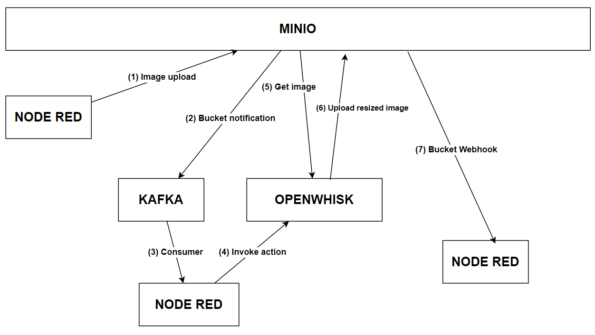
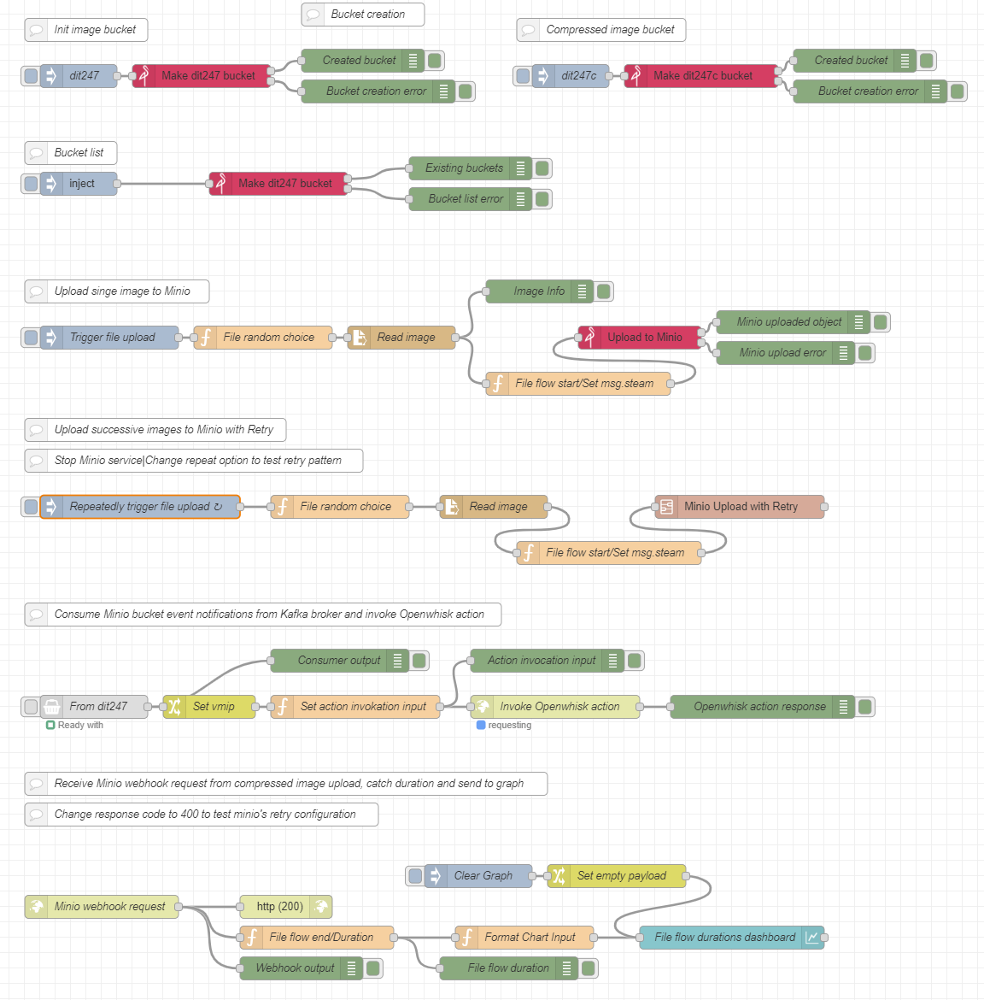
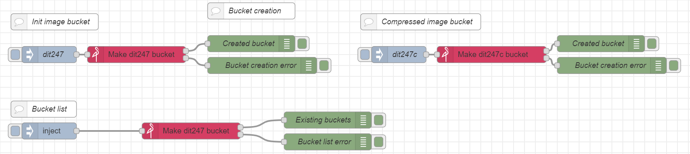
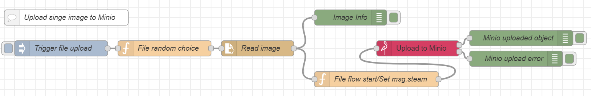
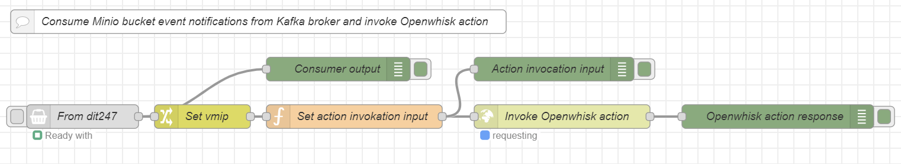
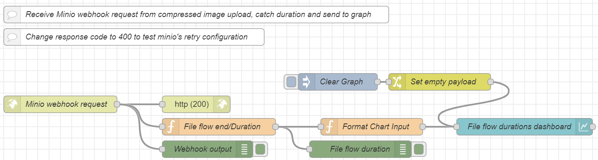
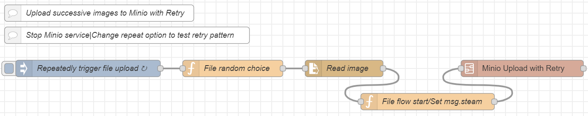
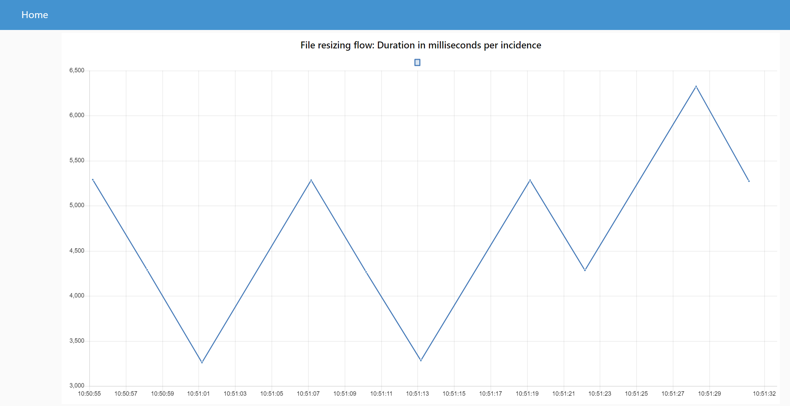

# General
Repo for the project of 2nd semester (2023-2024) course Cloud Computing of the postgraduate program Informatics and Telematics of Harokopio University.

# Scenario

This project implements a prototype which serves the purpose of an image resizing scenario.  
This could be one like the following:
- A company has implemented an application through which users can upload pictures to the application host, and due to the high usage, the need of effectively handling the uploaded content arises.
- A big online retail company has outsourced the management of their advertizing campaigns and there is a need of managing the load of their product codes relevant static content.

For each of the above scenarios we might want to design and implement a flow through which the static content (pictures in this case) when uploaded they are resized before permanent storage.

# Flow
## General
The general flow appears below:

## Details

Node red is used for the flow orchestration and setup:

- Two buckets assumed to exist in minio, **dit247** where the initial files are uploaded and **dit247c** where the images are uploaded after resizing.  
Those images can be created either from the minio UI or from a flow in nodered.

- **Step 1**: For simulation purposes, a local folder exists with a pool of images from where a picture is randomly selected to be uploaded in minio from a nodered flow.

- **Step 2**: Minio is setup to produce kafka notifications for image uploading
- **Step 3**: A kafka consumer nodered node is setup to receive the kafka messages and
- **Step 4**: invoke the image resizing action on openwhisk

- **Step 5**: Openwhisk action fetches the image from minio **dit247** bucket, resizes it and
- **Step 6**: sends it back to minio on **dit247c** bucket

- **Step 7**: In minio **dit247c** bucket a **webhook** has been setup whichs sends an image upload request to a nodered **http node** which displays the corresponding output.

- **Repeated flow for multiple files**: The flow can be triggered repeatedly using the flow below:

From here we can test the **retry pattern** by stopping the minio container, for example, to simulate failure.
- **Monitoring**: The flow duration for each file is monitored by catching corresponding *start* and *end* flow time and the duration is displayed in a graph on `localhost:1880/ui` using a chart nodered node.

# Tools
- **Environment setup**: Linux virtual machine in Windows 11 with *VirtualBox* and *Vagrant*
- **FaaS Platform**: *Openwhisk*
- **Messaging Systen**: *Kafka* with *Kafka UI*
- **Object Storage**: *Minio*
- **Orchestration**: *Node Red* for orchestration, setup and visualization

# Design Patterns

# Implementation

# SLA