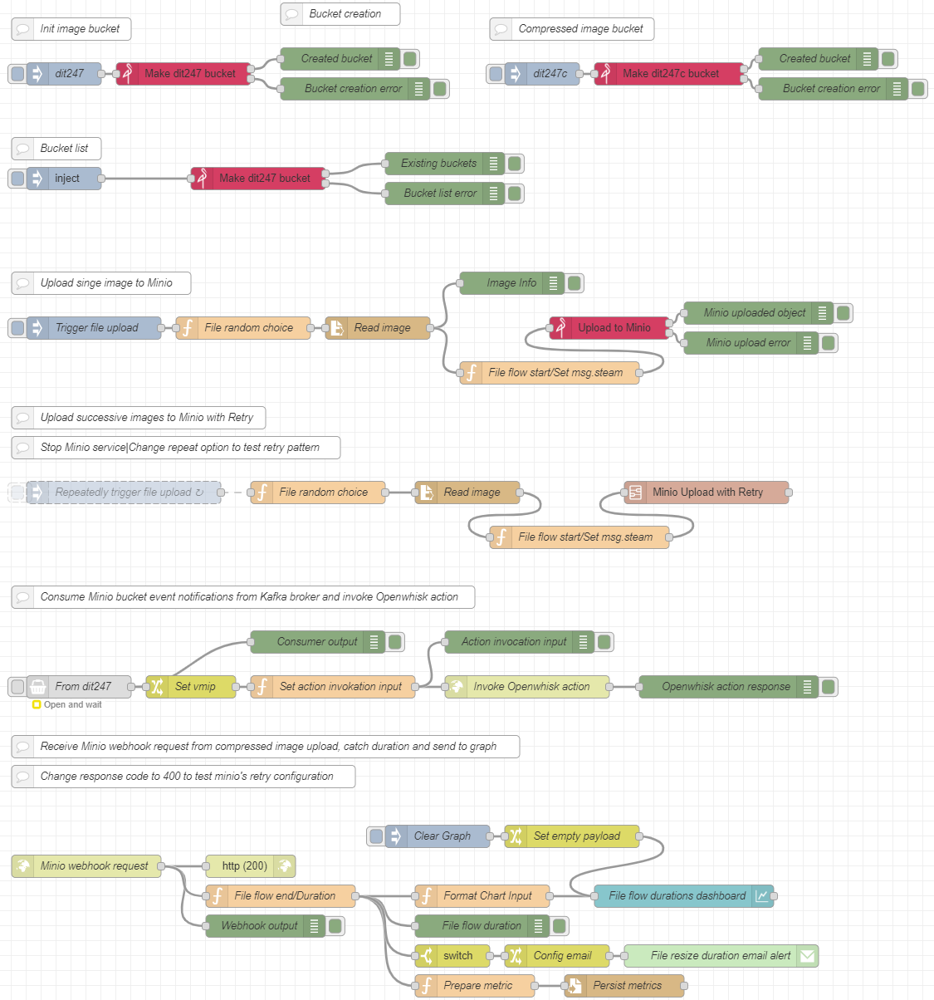

# General
Repo for the project of 4nd semester (2023-2024) course Cloud Computing of the postgraduate program Informatics and Telematics of Harokopio University.

# Scenario

This project implements a prototype which serves the purpose of an image resizing scenario.  
This could be one like the following:
- A company has implemented an application through which users can upload pictures to the application host, and due to the high usage, the need of effectively handling the uploaded content arises.
- A big online retail company has outsourced the management of their advertizing campaigns and there is a need of managing the load of their product codes relevant static content.

For each of the above scenarios we might want to design and implement a flow through which the static content (pictures in this case) when uploaded they are resized before permanent storage.

# Tools
- **Environment setup**: Linux virtual machine in Windows 11 with *VirtualBox* and *Vagrant*
- **Development**: Docker/docker compose
- **FaaS Platform**: *Openwhisk*
- **Messaging Systen**: *Kafka* with *Kafka UI*
- **Object Storage**: *Minio*
- **Orchestration**: *Node Red*

# Flow
## General
The general file resizing flow appears below:

## Details

Node red is used for the flow orchestration and setup:

- Two buckets assumed to exist in minio, **dit247** where the initial files are uploaded and **dit247c** where the images are uploaded after resizing.  
Those buckets can be created either from minio UI/cli directly or from a flow in nodered.

### Flow Steps Explanation

- **Step 1**: For simulation purposes, a local folder exists with a pool of images from where a picture is randomly selected to be uploaded in minio from a nodered flow.

- **Step 2**: Minio **dit247** bucket is setup to produce kafka notifications for image uploading as part of **pub/sub pattern**
- **Step 3**: A **kafka consumer nodered node** is setup to receive the kafka messages on topic **dit247** as part of the **pub/sub pattern** and
- **Step 4**: the image resizing action on openwhisk is invoked by a **nodered http request node**

- **Step 5**: Openwhisk action fetches the image from minio **dit247** bucket, resizes it and
- **Step 6**: sends it back to minio on **dit247c** bucket

- **Step 7**: In minio **dit247c** bucket a **webhook** has been setup whichs sends an image upload request notification to a **http in nodered node** which displays the corresponding output.

- **Repeated flow for multiple files**: The flow can be triggered repeatedly using the flow below:

From here we can test the **retry pattern** by stopping the minio container, for example, to simulate failure.
- **Monitoring**:
  - The flow duration for each file is monitored by catching corresponding *start* and *end* flow time and the duration is displayed in a graph on `localhost:1880/ui` using a **chart nodered node** and persisted to a file `metrics.txt` with a **write file nodered node**.  
  - If the file resize flow duration for a specific file exceeds **10 seconds**, then an email alert is sent with an **email nodered node**

# Design Patterns
- Retry Pattern
- Pub/Sub pattern
- Webhook Implementation

# Implementation details
## Development
The development environment is setup on a virtal machine using **VirtualBox** and **Vagrant** tools
- Shared folders are defined through VirtualBox
- On Vagrant ssh configurations are defined and provisioning for the tools required inside the virtual machine
  - **Docker** and **docker compose** instalation
  - **Openwhish** and **wsk cli** installation
  - Various other system tools

The other project components/services are setup using docker and docker compose, i.e.:
- **Kafka and UI**
- **Node red** (Non-built-in nodes are installed on dedicated dockerfile)
- **Minio** (cli client is installed on dedicated dockerfile)
- **Mailhog**

Ports from the containers/vm are forwarded through the VSCode port forwarding feature

## Minio
Directly through **mc cli** the service is configured to:
- Send bucket upload notifications on kafka topic **dit247** for bucket **dit247**
- Send bucket upload requests through a **webhook** to node red endpoint for bucket **dit247c**
## Node red
Installed nodes:
- [node-red-contrib-minio-all](https://flows.nodered.org/node/node-red-contrib-minio-all) for the communication with Minio
- [node-red-contrib-kafka-manager](https://flows.nodered.org/node/node-red-contrib-kafka-manager) for communicating with kafka
- [node-red-dashboard](https://flows.nodered.org/node/node-red-dashboard) for displaying the file resizing flow duration on dashboard
- [node-red-node-email](https://flows.nodered.org/node/node-red-node-email) for sending email alerts

The retry pattern is implemented as a subflow and used for the iamge upload to minio

## Openwhisk
For the openwhisk action implementation the **python v3.10 runtime** is used following the steps described [here](https://github.com/apache/openwhisk-runtime-python/blob/master/README.md#using-additional-python-libraries) but using a [**custom dockerfile**](https://github.com/akotronis/DIT247/blob/main/dit247/actions/dependencies/minio/Dockerfile.python)

## Demos
Demo videos can be seen below (from here: https://github.com/akotronis/DIT247/tree/main/static-files/Videos/Compressed)
### Single File Resizing Flow

<video width="800" controls><source src="https://github.com/user-attachments/assets/38b5fbcc-976d-478a-bb66-5e41058cff69" type="video/mp4"></video>

### Retry Pattern

<video width="800" controls><source src="https://github.com/user-attachments/assets/ca3048d4-baa8-49f7-8613-6b7e4ca1f771" type="video/mp4"></video>

### Repeated Flow with Dashboard

<video width="800" controls><source src="https://github.com/user-attachments/assets/4aa3fb0b-e26f-4943-8a63-6449af663d10" type="video/mp4"></video>

### Email Alert

<video width="800" controls><source src="https://github.com/user-attachments/assets/fc45531e-02b6-453b-8d86-d93bbc5e3cd2" type="video/mp4"></video>

## More Technical details
More technical details for each configuration step can be found in a separate README here https://github.com/akotronis/DIT247/blob/main/dit247/README-tech.md

## Potential Advantages
- **Scalability:** The use of cloud services like MinIO for object storage and Kafka for messaging allows the system to scale easily with increasing load. As the number of images increases, the architecture can handle more simultaneous processes without significant changes.
- **Modularity and Flexibility:** The architecture is highly modular, with each component (e.g., Node-RED for orchestration, OpenWhisk for serverless processing) being loosely coupled. This allows for easy modifications, replacements, or upgrades of individual components without affecting the entire system.
- **Real-time Processing:** The integration of Kafka with real-time messaging capabilities and the use of OpenWhisk for Function-as-a-Service (FaaS) enables quick processing of images, which is crucial for applications requiring low latency.
- **Cost Efficiency:** By utilizing serverless functions (OpenWhisk), you only pay for the compute time when the image resizing function is invoked. This can be more cost-effective compared to running a constantly active server.
- **Monitoring and SLA Enforcement:** The system is designed with built-in monitoring through Node-RED, allowing for real-time tracking of performance metrics and SLA compliance, which helps maintain service quality.
## Potential Disadvantages
- **Complexity:** The architecture involves multiple components and services (Node-RED, MinIO, Kafka, OpenWhisk), making the system complex to set up, manage, and debug. Any failure in one component might affect the entire workflow.
- **Latency Variability:** While the system generally performs well, the reliance on various cloud services introduces potential variability in latency, especially if any service experiences temporary performance degradation.
- **Dependence on Cloud Services:** The architecture is heavily dependent on the availability and performance of the cloud services used. Any downtime or issue with these services (e.g., MinIO, Kafka) can directly impact the system's operation.
- **Security Concerns:** Handling data across multiple cloud services and ensuring secure transmission and storage can be challenging. Security measures need to be robust to prevent unauthorized access or data breaches.

## Comparison with Current Architectures
- **Traditional Monolithic Architecture:** In traditional setups, image processing might be handled by a monolithic application running on a dedicated server or virtual machine, with all components (uploading, processing, storing) tightly integrated.  
The current architecture offers greater flexibility, scalability, and resilience compared to a monolithic approach. While a monolithic system might be simpler to deploy initially, it often struggles with scaling and is more difficult to update or modify.
- **Microservices Architecture:** Microservices architectures decompose applications into small, independent services that communicate over a network. This approach is similar to the current but often involves more traditional API-based communication rather than event-driven workflows.  
The current architecture can be considered a specialized microservices architecture with a strong emphasis on event-driven processing (using Kafka) and serverless functions. It benefits from the agility of microservices while leveraging serverless computing for specific tasks, potentially reducing costs.
- **Serverless Architecture:** Serverless architectures rely on cloud functions (like AWS Lambda, Azure Functions) to execute code in response to events without managing the underlying infrastructure.  
The use of OpenWhisk in the current solution aligns closely with modern serverless architectures. The advantage here is in the fine-grained control over function execution and cost efficiency.
- **Event-Driven Architecture:** Event-driven architectures use events to trigger and communicate between services. This is common in scenarios requiring real-time data processing.  
The current architecture is a good example of an event-driven system, with Kafka serving as the backbone for messaging and triggering processes. Compared to traditional API-driven communication, this approach allows for more responsive and scalable processing, though it introduces the complexity of managing message brokers and event streams.

# SLA Definition
## Objective
Ensure that the image resizing flow operates efficiently, with a clear performance benchmark that guarantees timely processing of images.

## Service Description

- **Service:** Image Resizing Flow
- **Scope:** The service covers the entire process from the moment an image is uploaded to the MinIO bucket **dit247** until the resized image is uploaded to the MinIO bucket (**dit247c**) and a triggered webhook request is received to acknowledge completion.

## Performance Metrics
### Response Time
- **Definition:** The time taken from the initial upload of an image to **dit247** until the resized image is uploaded to **dit247c** and the webhook triggers.
- **Guaranteed Performance:** The service guarantees that **99%** of image resizing operations will be completed within **10 seconds**.
- **Measurement Method:** The start and end times are recorded for each image, and the durations are monitored via a Node-RED chart node. A Continuous Distribution Function (CDF) is used to analyze these durations and ensure compliance.
### Availability
- **Service Uptime:** The system is expected to be operational and available **24/7** with an uptime of **99.9%**.
- **Downtime Impact:** If the service experiences downtime that affects more than **0.1%** of operations in a given month, compensatory measures or adjustments will be provided.
### Penalties:
- **Non-Compliance:** If the SLA is breached, meaning the processing time exceeds the **10-second** threshold for more than **1%** of the images, or if uptime falls below **99.9%**, the service provider may be required to investigate the cause and propose optimizations to ensure future compliance.

## SLA Monitoring and Reporting
- **Monitoring Tools:** Node-RED will monitor and log the duration of each image processing flow, with alerts configured to notify administrators if processing times exceed the SLA limits.
- **Reporting Frequency:** SLA performance will be reviewed monthly, with reports generated to assess compliance and identify any areas requiring improvement.

This SLA ensures that the cloud-based image resizing service is reliable, with clear performance expectations and monitoring mechanisms to maintain high standards.
