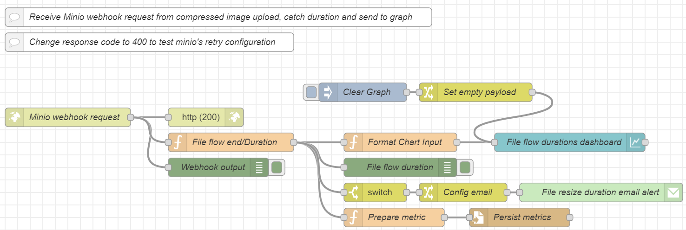

# General
Repo for the project of 2nd semester (2023-2024) course Cloud Computing of the postgraduate program Informatics and Telematics of Harokopio University.

# Scenario

This project implements a prototype which serves the purpose of an image resizing scenario.  
This could be one like the following:
- A company has implemented an application through which users can upload pictures to the application host, and due to the high usage, the need of effectively handling the uploaded content arises.
- A big online retail company has outsourced the management of their advertizing campaigns and there is a need of managing the load of their product codes relevant static content.

For each of the above scenarios we might want to design and implement a flow through which the static content (pictures in this case) when uploaded they are resized before permanent storage.

# Tools
- **Environment setup**: Linux virtual machine in Windows 11 with *VirtualBox* and *Vagrant*
- **FaaS Platform**: *Openwhisk*
- **Messaging Systen**: *Kafka* with *Kafka UI*
- **Object Storage**: *Minio*
- **Orchestration**: *Node Red*

# Flow
## General
The general flow appears below:

## Details

Node red is used for the flow orchestration and setup:

- Two buckets assumed to exist in minio, **dit247** where the initial files are uploaded and **dit247c** where the images are uploaded after resizing.  
Those buckets can be created either from the minio UI or from a flow in nodered.

- **Step 1**: For simulation purposes, a local folder exists with a pool of images from where a picture is randomly selected to be uploaded in minio from a nodered flow.

- **Step 2**: Minio is setup to produce kafka notifications for image uploading as part of **pub/sub pattern**
- **Step 3**: A **kafka consumer nodered node** is setup to receive the kafka messages on topic **dit247** as part of the **pub/sub pattern** and
- **Step 4**: the image resizing action on openwhisk is invoked by a **nodered http request node**

- **Step 5**: Openwhisk action fetches the image from minio **dit247** bucket, resizes it and
- **Step 6**: sends it back to minio on **dit247c** bucket

- **Step 7**: In minio **dit247c** bucket a **webhook** has been setup whichs sends an image upload request notification to a **http in nodered node** which displays the corresponding output.

- **Repeated flow for multiple files**: The flow can be triggered repeatedly using the flow below:

From here we can test the **retry pattern** by stopping the minio container, for example, to simulate failure.
- **Monitoring**: The flow duration for each file is monitored by catching corresponding *start* and *end* flow time and the duration is displayed in a graph on `localhost:1880/ui` using a **chart nodered node** and persisted to a file `metrics.txt` with a **write file nodered node**.  
If the file resize flow duration for a specific file exceeds **10 seconds**, then an email alert is sent with an **email nodered node**

# Design Patterns
- Retry Pattern
- Pub/Sub pattern
- Webhook Implementation

# Implementation details
## Development
The development environment is setup on a virtal machine using **VirtualBox** and **Vagrant** tools
- Shared folders are defined through VirtualBox
- On Vagrant ssh configuratins are defined and provisioning for the tools required inside the virtual machine
  - **Docker** and **docker compose** instalation
  - **Openwhish** and **wsk cli** installation
  - Various other system tools

The other project components/services are setup using docker and docker compose, i.e.:
- **Kafka and UI**
- **Node red** (Non-built-in nodes are installed on dedicated dockerfile)
- **Minio** (cli client is installed on dedicated dockerfile)
- **Mailhog**

Ports from the containers/vm are forwarded through the VSCode port forwarding tool

## Minio
Directly through **mc cli** the service is configured to:
- Send bucket upload notifications on kafka topic **dit247** for bucket **dit247**
- Send bucket upload requests through a **webhook** to node red endpoint for bucket **dit247c**
## Node red
Installed nodes:
- [node-red-contrib-minio-all](https://flows.nodered.org/node/node-red-contrib-minio-all) for the communication with Minio
- [node-red-contrib-kafka-manager](https://flows.nodered.org/node/node-red-contrib-kafka-manager) for communicating with kafka
- [node-red-dashboard](https://flows.nodered.org/node/node-red-dashboard) for displaying the file resizing flow duration on dashboard
- [node-red-node-email](https://flows.nodered.org/node/node-red-node-email) for sending email alerts

The retry pattern is implemented as a subflow and used for the iamge upload to minio

## Openwhisk
For the openwhisk action implementation the **python v3.10 runtime** is used following the steps described [here](https://github.com/apache/openwhisk-runtime-python/blob/master/README.md#using-additional-python-libraries) but using a [**custom dockerfile**](https://github.com/akotronis/DIT247/blob/main/dit247/actions/dependencies/minio/Dockerfile.python)

## Demos
Demo videos can be found [here](https://github.com/akotronis/DIT247/tree/main/static-files/Videos/Compressed)

## More Technical details
More technical details in separate README [here](https://github.com/akotronis/DIT247/blob/main/dit247/README-tech.md)

# SLA
